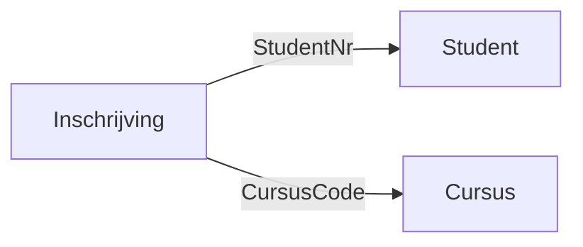
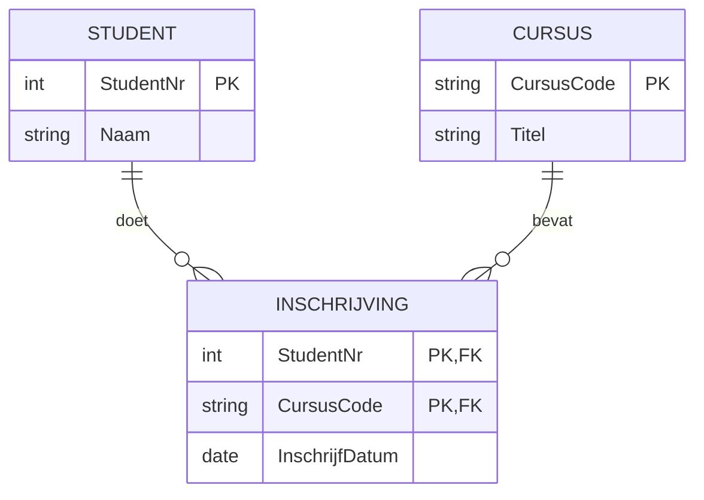

# 🗄️ Database Ontwerp

In deze module leer je hoe je een logisch en efficiënt database ontwerp maakt. In plaats van ingewikkelde wiskundige theorieën, pakken we het lekker praktisch aan: we kijken naar formulieren uit de praktijk (zoals facturen of bonnetjes) en vertalen die direct naar overzichtelijke tabellen.

---

## 🧭 Navigatie

🔹 [Week 1 – Basis Database Ontwerp](#week-1--basis-database-ontwerp)  
🔹 [Week 2 – Relaties & Diagrammen (ERD)](#week-2--relaties--diagrammen-erd)  
🔹 [Week 3 – Een Compleet Systeem Ontwerpen](#week-3--een-compleet-systeem-ontwerpen)  
🔹 [Week 4 – Je Ontwerp Presenteren](#week-4--je-ontwerp-presenteren)  

---

## Week 1 – Basis Database Ontwerp

🎯 **Focus**
- Waarom we gegevens slim moeten opslaan (voorkomen van duplicaten en fouten).
- Het herkennen van **Entiteiten** (dingen) en **Attributen** (eigenschappen).
- Hoe werken sleutelvelden (ID's en koppelingen)?
- De praktische ontwerpmethode: van formulier direct naar goede tabellen.

🧪 **Praktijk**
- Gegevens uit een inkooporder of bestelbon direct toewijzen aan de juiste tabel (zoals Klant, Bestelling, Product).

📄 **Aanvullende Lesnotities / Opdrachten**

### Wat ga je leren
Als programmeur wil je niet dat gegevens (zoals de naam van een klant) op honderd plekken worden opgeslagen. Wijzig je het op de ene plek, dan vergeet je de rest, of krijg je fouten. Daarom leer je tabellen maken waarin elk gegeven maar op één plek staat (het voorkomen van duplicaten). 

### Theorie

#### Wat is een Database?
Een database is een digitaal opgeslagen archief dat zo is gebouwd dat je flexibel gegevens kunt raadplegen. Een goede database moet voldoen aan de CRUD-eisen (Create, Read, Update, Delete) en moet **integer** zijn. Dat wil zeggen:
- Gegevens mogen niet dubbel worden opgeslagen (we willen geen *duplicaten*).
- De samenhang met andere gegevens moet kloppen (consistent).

#### Entiteiten en Attributen
- **Entiteit:** Een 'ding' of object waar we informatie over willen opslaan. Bijvoorbeeld een *Klant*, een *Factuur* of een *Product*.
- **Attribuut:** De eigenschappen (kenmerken) van een entiteit. De attributen van de entiteit *Product* kunnen bijvoorbeeld zijn: *Productnaam*, *Prijs*, en *Kleur*.

#### Sleutels (Primaire en Externe sleutels)
- **Primaire sleutel (ID):** Elke entiteit heeft een veld nodig dat hem 100% uniek maakt. Bijvoorbeeld een *Klantnummer* of *Artikelnummer*.
- **Externe sleutel (Foreign Key):** Om tabellen aan elkaar te koppelen, plaats je de primaire sleutel van de ene tabel in de andere tabel. Dit noemen we een externe sleutel.

#### Slim tabellen maken (Het Ontwerpproces)
Hoe vertaal je een papieren factuur naar een database? 
1. **Zoek de hoofdonderwerpen (Entiteiten):** Welke losse "dingen" zie je op het papier? Vaak is dat de `Klant` en de `Factuur` zelf.
2. **Wat zijn de regels?** Staat er een herhalende lijst op het formulier? Bijvoorbeeld een lijst met 5 gekochte artikelen. Maak daar altijd een aparte (koppel)tabel van, bijvoorbeeld `FactuurRegel`.
3. **Verdeel de details (Attributen):** Bekijk elk stukje tekst op het formulier. Hoort dit bij de Klant (Naam, Adres)? Bij de Factuur (Datum)? Of bij het Artikel (Prijs)? Zet ze in de juiste tabel.
4. **Koppel ze vast:** Zorg dat tabellen elkaar kunnen vinden via de sleutels (bijv. Klantnummer opslaan in de Factuur-tabel).

### Opdrachten

**Opdracht 1: Inkooporder Verschoor Groothandel**  
*Context:* Je werkt op de IT-afdeling van Verschoor Groothandel. Zij houden hun bestellingen bij leveranciers nog bij op papieren inkooporders. Aan jou de taak om dit te digitaliseren!

*Stappen:*
1. Bekijk de inkooporder hieronder. Welke hoofdonderwerpen (Entiteiten) zie je?
2. Verdeel de gegevens (Attributen) over deze tabellen. Zorg dat er geen duplicaten ontstaan.
3. Bepaal per tabel wat de Primaire Sleutel (uniek ID) is en waar je Externe Sleutels plaatst om de tabellen te koppelen.
4. Schrijf je eindresultaat overzichtelijk op.

```text
============================================================
                     INKOOPORDER
============================================================
Ordernummer : 90036
Datum       : 18-02-16
Inkoper     : Verbaken

LEVERANCIER
------------------------------------------------------------
G. Koopje
Langelaan 34
6822 GC Arnhem
Tel: 026-699125

BESTELDE ARTIKELEN
------------------------------------------------------------
BestelNR | Omschrijving       | Aantal | Prijs 
------------------------------------------------------------
488339   | Blu ray Arphils    | 1      | € 734.00 
293363   | LED tv ANOY        | 1      | € 867.00 
============================================================
```

**Opdracht 2: Bestelbon**  
*Context:* Een lokale kledingwinkel, "Koopgraag", werkt nog met fysieke bestelbonnen. Ze raken het overzicht kwijt en willen dat jij een systeem ontwerpt.

*Stappen:*
1. Doe hetzelfde als bij Opdracht 1, maar let op: je hebt nu kleding met maten. 
2. Bepaal zelf uit welke entiteiten deze bestelbon is opgebouwd en wijs de gegevens aan de juiste tabellen toe.
3. Bedenk de Primaire en Externe sleutels. Schrijf je tabellen met hun velden op.
```text
============================================================
                        BESTELBON
============================================================
Bestelbon Nr. : 765887
Datum         : 22-11-16
Klantnummer   : 54325

KLANTGEGEVENS
------------------------------------------------------------
Naam       : Koopgraag
Adres      : Credietlaan 33
Woonplaats : Kamphuis

BESTELDE KLEDINGSTUKKEN
------------------------------------------------------------
BestelNR | Omschrijving       | Maat | Aantal | Totaalprijs
------------------------------------------------------------
1068     | t-shirt            | 36   | 3      | € 38,85
1069     | t-shirt            | 38   | 2      | € 25,90
============================================================
```

## Advies voor deze week
- Vraag jezelf bij elk detail op een formulier af: "Heeft dit puur met de klant te maken, puur met het product, of hoort dit specifiek bij deze ene bestelling?"

🔝 [Terug naar navigatie](#-navigatie)

---

## Week 2 – Relaties & Diagrammen (ERD)

🎯 **Focus**
- Hoe tabellen samenwerken.
- Soorten relaties (1-op-1, 1-op-veel, veel-op-veel).
- Je ontwerp uittekenen: Strokendiagram en ERD (Entity-Relationship Diagram).

🧪 **Praktijk**
- Je database ontwerp visueel maken zodat andere programmeurs het begrijpen.
- Lijnen (pijlen) trekken tussen je tabellen in een diagram.

📄 **Aanvullende Lesnotities / Opdrachten**

### Wat ga je leren
Een lijst met platte tabellen is lastig te lezen voor je collega-programmeurs. Je leert hoe je van jouw ontwerp een professionele overzichtstekening maakt: het ERD.

### Theorie

#### Soorten Relaties
- **Eén-op-één (1:1):** Eén entiteit is gekoppeld aan maximaal één andere. 
- **Eén-op-meer (1:N):** Bijvoorbeeld één docent begeleidt meerdere klassen, maar een klas heeft altijd exact één mentor.
- **Meer-op-meer (N:M):** Meerdere studenten volgen meerdere cursussen. Let op: dit lossen we in databases op door een extra *koppeltabel* (zoals Inschrijving) er tussen te plaatsen!

#### Het Strokendiagram
In een strokendiagram teken je de tabellen als blokken, en trek je pijlen van een Externe Sleutel naar een Primaire Sleutel. Het toont precies wáár de koppeling zit. Hieronder zie je een voorbeeld van een school waarbij de koppeltabel `Inschrijving` verwijst naar de `Student` en de `Cursus`:



#### Het ERD (Entity-Relationship Diagram) / Bachman-diagram
Een ERD geeft visueel de verhoudingen (relaties) weer tussen de entiteiten. In plaats van te focussen op de exacte veldnamen, focust een ERD op *hoe* ze aan elkaar vast zitten met "kraaienpootjes" (crow's foot).


*(Uitleg symbolen: `||` betekent exact 1. `o{` betekent 0 of meer. Dit lees je dus als: 1 Student heeft 0 of meer Inschrijvingen).*

### 🛠️ Tooling: Zelf Diagrammen Tekenen met Draw.io
Om de ERD's en Strokendiagrammen voor de opdrachten te tekenen, gebruiken we **Draw.io** (ook wel [diagrams.net](https://app.diagrams.net) genoemd). Dit is een handige, gratis visuele tool waarmee je blokken en relaties heel makkelijk bij elkaar klikt.

**Stap 1: Draw.io openen**
1. Ga in je browser naar [app.diagrams.net](https://app.diagrams.net). Je hoeft niets te installeren.
2. Kies ervoor om een nieuw blanco diagram aan te maken (bewaar het bijvoorbeeld op je eigen computer of Google Drive).

**Stap 2: Het Strokendiagram tekenen**
Voor het strokendiagram heb je alleen maar simpele rechthoeken en pijlen nodig:
1. Pak uit het linkermenu onder het kopje **"General"** de `Rectangle` (Rechthoek) en sleep deze naar je werkveld. Typ de naam van je tabel in.
2. Maak nog een tabel. Klik op de rand van de eerste rechthoek en sleep de groene pijl naar de tweede rechthoek.
3. Dubbelklik op de pijl (de lijn) om de naam van de Externe Sleutel er direct boven te typen.

**Stap 3: Het ERD (Entity-Relationship Diagram) tekenen**
Voor een compleet ERD (inclusief attributen en 'kraaienpootjes') gebruiken we de speciale database-vormen in Draw.io:
1. Klik linksonder in het menu op **"+ More Shapes..."** (Meer vormen).
2. Zoek in het menu naar het kopje **"Software"** en vink **"Entity Relation"** aan. Klik op *Apply*.
3. Je hebt er in je linkermenu nu een heel blok bij: "Entity Relation". Hierin zie je perfect opgemaakte tabellen (waarin je netjes PK/FK en attributen kunt uittypen).
4. In ditzelfde blok vind je de pijlen met de correcte **kraaienpootjes** (zoals de pijl die zich opsplitst in drie uiteinden voor 1-op-veel). 
5. Sleep de tabellen naar je veld, vul je attributen in, en verbind ze met deze speciale relationele lijnen!

Als je klaar bent met een diagram, kun je via **File -> Export as -> PNG** de afbeelding opslaan zodat je het kunt inleveren.

### Opdrachten

**Opdracht 3: Factuur Electrochip B.V.**
*Context:* Electrochip B.V. stuurt maandelijks honderden facturen naar hun klanten. Ze willen inzicht in hun verkopen, maar dan moet de data wel goed opgeslagen en gekoppeld zijn. Jouw taak is om het ontwerp voor deze factuur te maken en het visueel te presenteren aan het ontwikkelteam.

*Stappen:*
1. Vertaal de onderstaande factuur naar tabellen. Bepaal zelf de juiste entiteiten en noteer de attributen en sleutels.
2. Maak het nu visueel: teken de tabellen met pijlen uit in een **Strokendiagram**.
3. Teken tot slot het **ERD** (Bachman-diagram) om de relaties te tonen. Vergeet de "kraaienpootjes" (1-op-veel) niet!

```text
============================================================
                         FACTUUR
============================================================
Factuur : 18416
Datum   : 20-11-16
Klantnr : 36756

BEDRIJF                                KLANT
------------------------------------------------------------
Electrochip B.V.                       K. Lant
Vogelstraat 31                         Einsteinstraat 1
4711 BL Duiven                         4991 AC Duiven
Bank: BTM-banknr 5431.16.123

GELEVERDE ARTIKELEN
------------------------------------------------------------
Datum    | Artikelnr | Omschrijving  | Aantal | Bedrag
------------------------------------------------------------
18-10-16 | 1011      | Monitor Xplay | 4      | € 1.000,00
18-10-16 | 2020      | Blu ray       | 3      | € 7.350,00
============================================================
```

## Advies voor deze week
- Lees een relatie (de kraaienpoot in je ERD) altijd twee kanten op! Controleer jezelf: "Eén klant heeft meerdere facturen" EN "Eén factuur hoort bij exact één klant". Klopt dat? Dan heb je het goed getekend.

🔝 [Terug naar navigatie](#-navigatie)

---

## Week 3 – Een Compleet Systeem Ontwerpen

🎯 **Focus**
- Meerdere documenten of systemen aan elkaar knopen.
- Voorkomen van duplicaten in het gehele systeem.

🧪 **Praktijk**
- Gegevens uit een magazijnkaart, leveranciersinfo en inkooporder combineren tot één vlekkeloos datamodel.

📄 **Aanvullende Lesnotities / Opdrachten**

### Wat ga je leren
In een echt bedrijf heb je nooit te maken met maar één formulier. Je hebt de kassa, het magazijnsysteem, en de inkoop. Hoe voeg je die allemaal samen in één database zonder dat het een rommeltje wordt?

### Theorie (Modellen Samenvoegen)
Als je een `Magazijnkaart` en een `Bestelbon` los van elkaar ontwerpt, krijg je in beide ontwerpen waarschijnlijk een tabel `Artikel`. Als je deze systemen samenvoegt voor het bedrijf, mag je de tabel `Artikel` niet twee keer in je database zetten (dat veroorzaakt duplicaten!). 

Je voegt de twee tabellen samen tot één grote `Artikel` tabel, waarbij je de unieke attributen uit beide documenten in deze gecombineerde tabel zet.

### Opdrachten

**Opdracht 4: Het Magazijn (Samenvoegen)**
*Context:* Groothandel "Vlug en Voordelig" werkt momenteel met drie gescheiden systemen: de inkoop, het magazijnbeheer en een leverancierslijst. Omdat ze niet aan elkaar gekoppeld zijn, moeten medewerkers gegevens (zoals artikelnamen) steeds dubbel intypen.

*Stappen:*
1. Lees de drie onderstaande documenten (A, B, en C).
2. Ontwerp één centrale database waarin alle informatie uit de drie formulieren past. Zorg absoluut dat er géén duplicaten ontstaan in je ontwerp! Combineer ze slim.
3. Teken het overkoepelende ERD van jouw nieuwe, verbeterde systeem.

<br>

#### 📄 Document A: INKOOP ORDER

```text
============================================================
INKOOP ORDER                DATUM: 16-10-2016
ORDERNR: 2871
------------------------------------------------------------
Leverancier: 13621 Vlug en voordelig, Industrieweg 6, Zevenhuizen

ARTIKELEN
------------------------------------------------------------
Aantal | Artikelnr | Omschrijving | Prijs
------------------------------------------------------------
20     | 12/316    | Hamer        | € 298,00
5      | 52/370    | Tang         | € 87,00
------------------------------------------------------------
Totaal: € 385,00
Gewenste leveringsdatum: 30-11-16
Inkoper: K. Orting
============================================================
```

<br>

#### 📄 Document B: MAGAZIJNKAART

```text
============================================================
MAGAZIJNKAART
------------------------------------------------------------
Artikelnr    : 12/316           Stelling : H
Omschrijving : Hamer            Vak      : 12
Voorraad     : 240

BESTELLINGEN
------------------------------------------------------------
Ordernummer | Leveringsdatum | Aantal
------------------------------------------------------------
2871        | 30-11-2016     | 20
2913        | 04-12-2016     | 60
============================================================
```

<br>

#### 📄 Document C: LEVERANCIERSINFORMATIE

```text
============================================================
LEVERANCIER: 13621 Vlug en voordelig
------------------------------------------------------------
ARTIKELEN ASSORTIMENT
Nummer | Code    | Omschrijving | Levertijd
------------------------------------------------------------
G.2106 | 121/316 | Hamer        | Uit voorraad
G.2107 | 43/360  | Boor         | 1 week
G.2108 | 52/370  | Tang         | uit voorraad
============================================================
```

## Advies voor deze week
- Kijk heel goed waar overlap in de documenten zit. Kom je ergens een Leverancier én ergens anders een Leverancier tegen? Gooi ze dan samen in je ontwerp.

🔝 [Terug naar navigatie](#-navigatie)

---

## Week 4 – Je Ontwerp Presenteren

🎯 **Focus**
- Een professioneel rapport maken van jouw database.

🧪 **Praktijk**
- Het opstellen van een Technisch Ontwerp (TO) voor de klant.

📄 **Aanvullende Lesnotities / Opdrachten**

### Wat ga je leren
Programmeren draait niet alleen om code schrijven achter je laptop. Je moet je logica en plan ook goed kunnen overdragen aan de klant, projectleider of andere developers. Daarvoor schrijf je een officieel Technisch-ontwerp-rapport.

### Theorie (Opbouw Technisch Ontwerp)
Een standaard Technisch-ontwerp-rapport (TO) bevat:
1. **Voorblad & Inhoudsopgave**
2. **Samenenvatting / Inleiding:** Wat ga je bouwen en voor wie?
3. **Technische infrastructuur:** 
   - **Schema's:** Welke formulieren of processen heb je geanalyseerd? (Strokendiagrammen).
   - **Database-ontwerp:** Je uitgeschreven tabellen met Primaire/Externe sleutels en hun datatypen (zoals `Int`, `Varchar`).
   - **ERD:** Je Bachman-diagram of Entity-Relationship Diagram.
4. **Beveiliging / Conclusie:** Hoe ga je om met de privacy van de gegevens?

### Opdrachten

**Opdracht 5 (Het Eindproduct):** 
*Context:* Je bent ingehuurd als externe Database Designer door kledingwinkel "Koopgraag". Ze sturen bestelbonnen naar leveranciers, afleveringsbonnen naar klanten, en maken maandelijks rekeningoverzichten. De administratie is inmiddels één grote chaos. Jouw opdracht is om dit op te lossen met een spiksplinternieuw database ontwerp, netjes verpakt in een rapport.

*Stappen:*
1. Analyseer de drie documenten (A, B en C) hieronder. Ontwerp de tabellen en voeg ze samen tot één groot database ontwerp zonder duplicaten.
2. Schrijf de tabellen met de Primaire/Externe sleutels uit en teken het complete ERD.
3. Verwerk jouw oplossing in een professioneel **Technisch Ontwerp Rapport** dat je aan de directie van Koopgraag kunt presenteren. Volg hiervoor de indeling uit de theorie (met Voorblad, Inleiding, Schema's en Conclusie).

<br>

#### 📄 Document A: BESTELBON

```text
============================================================
BESTELBON Nr. 765887                   Datum: 22-11-16
Klantnr: 54325
------------------------------------------------------------
Naam       : Koopgraag
Adres      : Credietlaan 33
Woonplaats : Kamphuis

REGELS
------------------------------------------------------------
BestelNR | Omschrijving | Maat | Aantal | Totaalprijs
------------------------------------------------------------
1068     | t-shirt      | 36   | 3      | € 38,85
1069     | t-shirt      | 38   | 2      | € 25,90
2617     | slip         | 4    | 6      | € 19,00
============================================================
```

<br>

#### 📄 Document B: AFLEVERINGSBON

```text
============================================================
AFLEVERINGSBON                         Datum: 03-12-2016
Klantnummer: 783129
------------------------------------------------------------
GELEVERD
Aantal | BestelNR | Omschrijving | Maat | Bedrag
------------------------------------------------------------
2      | 1068     | t-shirt      | 36   | € 25,90
1      | 1068     | t-shirt      | 38   | € 12,95
6      | 2617     | slip         | 4    | € 19,00

NA TE ZENDEN
Aantal | BestelNR | Omschrijving | Maat |
------------------------------------------------------------
2      | 1068     | t-shirt      | 36   |
1      | 4315     | dekenkist    |      |
============================================================
```

<br>

#### 📄 Document C: REKENINGOVERZICHT

```text
============================================================
REKENINGOVERZICHT                      Datum: 03-12-2016
Klantnummer: 783129
------------------------------------------------------------
Eindsaldo vorig overzicht: € 150,00

VERRICHTE BOEKINGEN
BestelNR | Boekingsoort | Maat | Aantal | Bij      | Af
------------------------------------------------------------
1068     | T-shirt      | 36   | 2      | € 25,90  |
1068     | t-shirt      | 38   | 1      | € 12,95  |
2617     | slips        | 4    | 6      | € 19,00  |
         | betaling     |      |        |          | € 30,00

KLANTGEGEVENS
Koopgraag
Credietlaan 33
Kamphuis

Nieuw saldo: € 177,85
Te betalen voor: 24-12-2016
============================================================
```

🔝 [Terug naar navigatie](#-navigatie)
